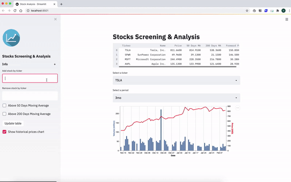

# Stocks Screening & Analysis App

A CRUD streamlit app with FastAPI backend for US stocks screening and analysis. Stock data is imported from the [yfinance](https://pypi.org/project/yfinance/) library.

### Set up environment
```
source venv/bin/activate
```

### Run Docker
```
docker-compose build
docker-compose up
```

### Access Streamlit App
```
http://localhost:8501
```

### Demo:



### References:

[streamlit-fastapi-model-serving](https://github.com/davidefiocco/streamlit-fastapi-model-serving)

[Hacking the markets](https://github.com/hackingthemarkets)
