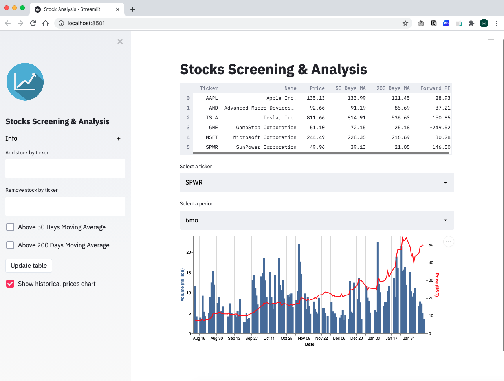

# Stocks-Analysis-App

A CRUD streamlit app with FastAPI backend for US stocks screening and analysis. Stock data is imported from the [yfinance](https://pypi.org/project/yfinance/) library.

### Step 1. Set up environment
```
source venv/bin/activate
```

### Step 2. Run FastAPI server
```
uvivorn main:app --reload
```

### Step 3. Run Streamlit App UI
```
streamlit run ui.py
```

### Snapshot:


